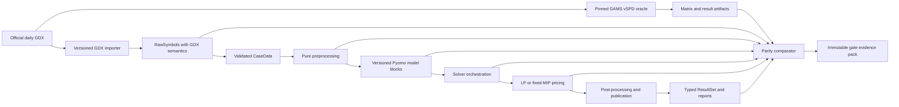

# PySPD: validated Pyomo implementation of vSPD

## Stage-and-gate delivery and assurance reference

| Document field | Value |
|---|---|
| Status | Controlled reference; executed through Gate 7 |
| Document version | 0.2 |
| Date | 29 August 2026 |
| Repository | `pySPD` |
| Reference compatibility baseline | vSPD `v5.0.6`, commit `21b1cf33f5607399331dcb1c03270348def5ccc8` |
| Governing formulation context for v5 features | SPD Model Formulation v15.0 |
| Package manager | `uv` only |
| Primary modelling framework | Pyomo |
| Initial portability solver | HiGHS |
| Historical parity solver | CPLEX |
| Next formal review | Gate 8 |

## 1. Purpose and authority

This document defines the controlled route from an empty Python package to a
reproducible, validated, tested, and independently reviewable Pyomo
implementation of the Electricity Authority's vectorised Scheduling, Pricing,
and Dispatch model (vSPD).

It is the project reference for:

- scope and source-of-truth decisions;
- target architecture and package boundaries;
- test-driven development and evidence requirements;
- stage deliverables and gate acceptance criteria;
- numerical, economic, and reporting validation;
- release claims, independent review, and formulation upgrades; and
- ownership, risk, change control, and long-term maintenance.

A stage is a bounded body of work. A gate is a formal decision based on
reviewable evidence. Passing a gate permits the next stage; elapsed time or
feature completion alone does not.

The current Stage 0 implementation artifacts are indexed in the
[Gate 0 baseline and decision pack](gate-0/README.md). That pack remains a
candidate until its mandatory holds and signatures are closed.

This plan does **not** assert that the current public vSPD release, or any future
PySPD implementation, is audited. The last located independent certificate is
for vSPD v3.0.4 against SPD Formulation 11.2, not the current public v5 source.

## 2. Executive delivery decision

PySPD will use two deliberately separate formulation tracks.

1. **Reference compatibility track.** Reproduce the public vSPD v5.0.6 source at
   pinned commit `21b1cf33f5607399331dcb1c03270348def5ccc8`. This is the first
   validation and release target.
2. **Current-formulation track.** Implement SPD Formulation v16 changes only as
   an explicitly versioned delta after authoritative source rules, data
   mappings, and expected outputs are available and approved.

The public v5.0.6 source predates the SPD v16 production change on 23 June 2026.
The v16 tie-break, battery, and reserve-pricing rules must therefore not be
silently backported into the v5 compatibility model. A caller must select a
named formulation version, and every result must report that version.

The initial release claim sought is:

> For the declared v5.0.6 scope and pinned solver profiles, PySPD reproduces the
> reference model's structure, feasible economics, control-flow decisions, and
> published outputs within the approved quantity-specific tolerances, with all
> exceptions disclosed and independently reviewed.

The word **audited** may be used only after an appropriately independent party
has audited the specific PySPD version, baseline, corpus, solver profiles, and
claim.

## 3. Objectives, success measures, and non-goals

### 3.1 Objectives

PySPD must:

- express the supported vSPD formulation as maintainable, typed Pyomo model
  components;
- use class-based formulation, component, assembler, solver, pricing, and report
  contracts so new versions and features are modular, replaceable, and testable;
- consume daily pricing data without requiring GAMS during normal operation;
- retain a provenance-complete path from original GDX records to every result;
- reproduce the GAMS reference matrix and solve/re-solve semantics;
- reproduce dispatch, reserve, loss, risk, scarcity, price, and report outputs;
- distinguish legitimate alternative optima from implementation defects;
- support deterministic reference runs and practical portable runs;
- emit useful infeasibility and numerical-quality diagnostics;
- be developed under enforced test-driven development; and
- be releasable from a frozen `uv.lock` with repeatable evidence.

### 3.2 Programme-level success measures

The project is successful when all of the following are true:

- every in-scope source equation, symbol, preprocessing branch, solve branch,
  and reported field is represented in a bidirectional traceability matrix;
- every implementation requirement has a test that failed before the
  production change was written;
- all required structural, microcase, oracle, historical, metamorphic, and
  failure tests pass;
- the complete qualification corpus has zero unexplained material mismatches;
- PySPD's published-price outputs match the pinned vSPD oracle at its output
  precision, while comparisons with official SPD/market prices are separately
  classified;
- deviations, degeneracies, exclusions, and solver dependencies are explicit;
- an independent validation lead accepts the evidence pack;
- the release is reproducible from a clean checkout using `uv`; and
- the approved performance and operational thresholds are met without
  weakening correctness criteria.

### 3.3 Initial non-goals

The first compatibility release does not include:

- FTR or Pivot modes referenced by the controller but absent from the inspected
  public source tree;
- an operational replacement for Transpower's production SPD system;
- a graphical user interface;
- undocumented reconstruction of proprietary SPD behavior;
- v16 behavior inside the v5.0.6 formulation selection;
- bit-for-bit equality of arbitrary primal variables in degenerate optima; or
- a claim that the 2019 vSPD v3.0.4 audit covers PySPD or vSPD v5.0.6.

Demand/DWH modes, legacy v3/v4 inputs, and additional reports may be promoted
from deferred scope only through the change-control process in section 18.

## 4. Baselines and source-of-truth hierarchy

### 4.1 Frozen reference compatibility baseline

The Gate 0 baseline candidate is:

- repository: [ElectricityAuthority/vSPD](https://github.com/ElectricityAuthority/vSPD);
- tag: `v5.0.6`;
- commit: `21b1cf33f5607399331dcb1c03270348def5ccc8`;
- commit date: 21 November 2025;
- readable formulation source:
  [`vSPDmodel.gms`](https://github.com/ElectricityAuthority/vSPD/blob/21b1cf33f5607399331dcb1c03270348def5ccc8/Programs/vSPDmodel.gms);
- load, preprocessing, solve, and post-processing source:
  [`vSPDsolve.gms`](https://github.com/ElectricityAuthority/vSPD/blob/21b1cf33f5607399331dcb1c03270348def5ccc8/Programs/vSPDsolve.gms);
- top-level orchestration:
  [`runvSPD.gms`](https://github.com/ElectricityAuthority/vSPD/blob/21b1cf33f5607399331dcb1c03270348def5ccc8/Programs/runvSPD.gms);
- case and period selection:
  [`vSPDperiod.gms`](https://github.com/ElectricityAuthority/vSPD/blob/21b1cf33f5607399331dcb1c03270348def5ccc8/Programs/vSPDperiod.gms);
- overrides:
  [`vSPDoverrides.gms`](https://github.com/ElectricityAuthority/vSPD/blob/21b1cf33f5607399331dcb1c03270348def5ccc8/Programs/vSPDoverrides.gms); and
- reporting:
  [`vSPDreport.gms`](https://github.com/ElectricityAuthority/vSPD/blob/21b1cf33f5607399331dcb1c03270348def5ccc8/Programs/vSPDreport.gms).

The readable `.gms` source is normative. A compiled `.g00` file may be retained
as provenance but must not be treated as the maintainable specification.

Pinned v5.0.6 implements Link Risk and AC Secondary Risk introduced in
[SPD Model Formulation v15.0](https://static.transpower.co.nz/public/bulk-upload/documents/SPD_Model_Formulation_v15.0.pdf?VersionId=uP8I7FqRHyGEJOK5ypCz5PAGXwchXgjk).
Gate 0 must pin that document and reconcile its applicable clauses
bidirectionally against the v5.0.6 source. For the compatibility claim, the
readable pinned vSPD behavior remains the executable oracle; the v15 mapping
provides governing intent and exposes source/formulation differences.

#### Historical compatibility profiles

The vSPD README states that real-time pricing broke backward compatibility on
1 November 2022. PySPD must therefore never imply that one unversioned adapter
or model is universally compatible with all historical inputs. The compatibility
matrix is:

| Profile | Applicable data | Assurance use |
|---|---|---|
| Audited legacy, vSPD v3.0.4 | The exact audit inputs against SPD Formulation 11.2 | Reproduce the 2019 certificate scope only; do not generalize it to v3.1/v4/v5 |
| Legacy final pricing, vSPD v3.1.0 | GDX through 31 October 2022 | Separately pinned final pre-RTP adapter/model and historical holdout profile |
| RTP v4 | Post-1 November 2022 GDX using the original RTP schema | Separately pinned migration and holdout profile |
| Daily pricing v5+ | `Pricing_YYYYMMDD.gdx` using a versioned consolidated daily schema for dates from 1 November 2022 | Primary v5.0.6 compatibility and release profile |

The first release target remains v5.0.6. v3.1.0 and v4 support are versioned
follow-on profiles unless Gate 0 explicitly brings them into scope. Their audit
and regression evidence can inform v5 tests, but results from a different source
version cannot certify v5 behavior by substitution. See the
[pinned compatibility statement](https://github.com/ElectricityAuthority/vSPD/blob/21b1cf33f5607399331dcb1c03270348def5ccc8/README.md)
and [vSPD v5.0.0 release](https://github.com/ElectricityAuthority/vSPD/releases/tag/v.5.0.0).

The 2019 certificate also excluded dead/disconnected-node logic, pricing-node to
electrical-node mapping, bad-price removal, and then-new intermittent-generation
arrangements. PySPD treats those as explicit new validation obligations, not as
implicitly covered behavior.

The original v5 interface consolidated 108 symbols to 42, but `42` is not a
permanent schema invariant. Pinned v5.0.6 conditionally loads the additional
`i_dateTimeRiskGroupBranch` symbol from 17 March 2025. Schema identifiers and
effective dates—not an assumed symbol count—govern compatibility. See the
[pinned load branch](https://github.com/ElectricityAuthority/vSPD/blob/21b1cf33f5607399331dcb1c03270348def5ccc8/Programs/vSPDsolve.gms#L350-L368).

### 4.2 Current-formulation delta

The Electricity Authority announced SPD changes effective 23 June 2026 for a
new tie-breaker, temporary prevention of nonphysical BESS dispatch, and reserve
pricing. Those changes are described in
[SPD Model Formulation v16.0](https://static.transpower.co.nz/public/bulk-upload/documents/SPD_Model_Formulation_v16.0.pdf?VersionId=EnEG04rp0YdSazhUCjOYXic7BQWcXosF)
and the
[Authority's implementation update](https://www.ea.govt.nz/news/general-news/updates-to-the-vectorised-scheduling-pricing-and-dispatch-model/).

The public vSPD commit pinned above does not contain that delta. Gate 11 must
therefore treat v16 as a new formulation version with its own requirements,
fixtures, oracle evidence, corpus, and release claim.

### 4.3 Source hierarchy

When two sources disagree, the project records the conflict and obtains a
formal decision. It does not silently choose the easiest behavior. Unless a
formulation-specific decision record says otherwise, evidence is ranked as:

1. approved statutory or market-rule requirements and the applicable official
   SPD formulation;
2. the pinned readable vSPD source for the selected compatibility version;
3. the versioned GDX symbol contract and official dataset documentation;
4. reproducible execution of the pinned GAMS source under the reference solver
   profile;
5. authoritative published prices and reports;
6. release notes, audit certificates, and worked examples; and
7. project interpretation documented in an architecture or model decision
   record.

For the compatibility track, the pinned vSPD source defines intentional vSPD
behavior even where later SPD formulations differ. For the current-formulation
track, the approved formulation and market rules take precedence, and the
implementation version must make the difference visible.

### 4.4 Legal and provenance condition

Gate 0 requires a recorded review of the
[EMI tools licence](https://www.emi.ea.govt.nz/Content/Legal-Information/EMI%20tools%20license.pdf),
source attribution, dataset conditions, solver licences, and redistribution of
fixtures and derived oracle artifacts. No public package or large test corpus is
released until that review states what may be copied, adapted, redistributed,
or fetched on demand.

## 5. Functional scope map

The compatibility model must cover the behaviors that materially affect the
reference objective, feasibility, solve path, or output.

| Area | Required capability |
|---|---|
| Case control | Select files, cases, trading periods, published cases, and publication-duration weights |
| Input data | Load case, topology, offer, bid, reserve, risk, loss, constraint, scarcity, and mapping symbols |
| Required load | Reconstruct real-time dispatch load using the applicable date- and case-dependent rules |
| Offers and bids | Energy and reserve blocks, capacity, intermittent limits, primary/secondary relationships, discrete bids |
| Ramping | Generation-start and interval-duration ramp limits with reference soft violations; schedule fallback from the prior solved output in orchestration |
| AC network | DC load flow, bus balance, angles, branch limits, outages, fixed and piecewise-linear losses |
| HVDC | Directional flow, capacities, fixed/PWL losses, SOS behavior, circular/nonphysical flow handling |
| Reserve | FIR/SIR co-optimization and PLRO, TWRO, and ILRO products |
| Risks | Generator, group, manual, DC, link, directional-link, and secondary risk families |
| Reserve sharing | NMIR transfer, free reserve/control bands, factors, operating zones, and discrete decisions |
| Security | Branch and market-node LE, GE, and EQ constraints and all supported factors |
| Scarcity | Energy scarcity, reserve shortfall tranches, limits, prices, and violation penalties |
| Objective | Demand benefit less energy/reserve cost, scarcity/violation cost, the v5 `0.0005` RTD generation-change perturbation, and `1e-5`/`2e-5`/`3e-5` reserve-sharing perturbations |
| Solve control | Model selection, MIP/LP handling, circulation re-solves, shortfall transfer, bounded loops, termination checks |
| Pricing | Raw bus duals, fixed-MIP pricing where applicable, node allocation, invalid/dead/disconnected price handling |
| Publication | Duration-weighted energy and reserve prices |
| Overrides | Supported demand, offer, bid, topology, capacity, and constraint counterfactuals |
| Reporting | Summary, island, bus, node, offer, bid, reserve, risk, branch, constraint, published-price, and audit outputs |

Gate 0 freezes a supported-case-type matrix. The primary daily Pricing dataset
qualifies RTD and PRSS, with RTDP where present; it does not by itself qualify
PRSL, NRSS, NRSL, or WDS. Any additional case type requires an applicable
versioned input source, oracle profile, feature-complete fixtures, and its own
Gate 9 coverage. Otherwise it remains explicitly deferred from the first-release
claim.

## 6. Engineering and assurance principles

### 6.1 Probity-enforced test-driven development

All production model, data, solver, pricing, reporting, and supporting-tool
changes follow red-green-refactor:

1. identify the source requirement and intended observable behavior;
2. add the smallest test that expresses that behavior;
3. run it and retain evidence that it fails for the expected reason;
4. write the minimum production change needed to pass;
5. run the focused and affected suites;
6. refactor while green; and
7. add or update traceability and parity evidence.

The repository's Probity hook enforces TDD on `src/**`, package modules,
`tests/**`, and `tools/**` during supported interactive work. That local
`PreToolUse` hook is a guardrail, not sufficient audit proof. CI must require an
immutable red/green ledger entry for every production change. The red artifact
records the parent-commit hash, test blob/patch hash, exact `uv run` command,
environment hash, nonzero exit, expected failure fingerprint, and output hash;
the green artifact binds the same test to the implementation commit and passing
output. CI checks changed production paths against those entries.

Bypassing either control is a quality event. A justified exception requires a
recorded reason, independent reviewer approval, expiry, and follow-up test before
merge. Generated reference artifacts may never be used as their own oracle, and
a failing lint/import/environment run does not count as a behavioral red test.

### 6.2 Evidence before assertion

- A model that solves is not necessarily correct.
- An equal objective is not sufficient to prove equivalent constraints.
- Equal dispatch does not prove correct prices.
- Equal prices on one day do not prove correct control flow or edge behavior.
- Solver `optimal` status is accepted only with residual and quality checks.
- A golden output is trusted only when its origin, input hash, executable source,
  options, and solver environment are known.

### 6.3 Stable semantics over literal translation

The Pyomo implementation should preserve the mathematics and observable
behavior, not GAMS syntax. Procedural preprocessing becomes typed
`PreprocessorStep` classes performing pure transformations; algebra becomes
named Pyomo Blocks owned by component classes; solver and pricing behavior is
owned by explicit class contracts. Every departure from literal source
structure must remain traceable to the source behavior it replaces.

### 6.4 Sparse and deterministic by design

- Preserve source ordering wherever GAMS `ord`, lag, lead, or SOS semantics use
  it.
- Preserve the difference between an absent sparse record and a stored zero.
- Preserve GAMS special values, including EPS, NA, and UNDEF, through canonical
  conversion.
- Build sparse tuple domains and adjacency maps instead of dense Cartesian sets
  followed by `Constraint.Skip`.
- Pin versions, options, seeds, algorithms, and thread counts in deterministic
  evidence profiles.

### 6.5 Independent acceptance

The implementer of a component may demonstrate it, but may not be the sole
person accepting its gate evidence. Gate 9 and Gate 10 validation must be led by
someone organizationally independent of the core implementation work.

## 7. Target technical architecture

### 7.1 Processing architecture



### 7.2 Package boundaries

The target package layout is:

```text
src/pyspd/
  domain/          identifiers, CaseData, configuration, result schemas
  io/              GDX import, canonical storage, exports
  preprocess/      PreprocessorStep classes, pipeline, validation, derived data
  model/
    base.py         ModelComponent and Formulation abstract base classes
    context.py      immutable BuildContext, BuiltModel, ModelArtifacts
    assembler.py    dependency-aware ModelAssembler
    formulations/   Vspd506Formulation, later Spd16Formulation classes
    components/     class-based energy, transmission, loss, reserve, risk,
                    security, scarcity, and objective Block builders
  solve/            backend contract, profiles, orchestration, diagnostics
  pricing/          LP/fixed-MIP pricing, normalization, price checks
  reporting/        versioned ResultSchema and ReportRenderer classes
  diagnostics/      run artifacts, residuals, IIS, Farkas, relaxations
  pipeline.py       application workflow
tests/
  unit/             pure transformation, class-contract, and schema tests
  algebra/          analytic microcases and matrix assertions
  integration/      vertical slices and solver behavior
  parity/           GAMS/Pyomo comparisons
  regression/       historical defect and edge-case cases
  performance/      construction, solve, memory, update benchmarks
```

Boundary rules are mandatory:

- `io` does not import Pyomo;
- input models are immutable after validation;
- preprocessing is deterministic and solver-independent;
- each functional area creates a named Pyomo `Block` with stable component
  names;
- a versioned assembly contract assigns ownership of every shared set, variable,
  expression, and constraint, defines permitted acyclic block dependencies and
  construction order, and accepts objective contributions through one explicit
  interface;
- builders do not solve, write reports, or mutate source data;
- builders do not mutate `CaseData` or components owned by an already assembled
  block;
- a `ModelArtifacts` registry exposes price-bearing constraints, discrete
  variables, objective components, and reported quantities without string
  searches; and
- solver-specific code remains behind the project-owned backend contract.

### 7.3 Class-based modularity contract

The implementation uses composition and explicit class contracts. It does not
put the entire formulation in one `ConcreteModel` subclass, and it does not use
an unstructured collection of builder functions.

The core class design is:

```text
ModelComponent (ABC)
  key
  dependencies
  provides
  is_enabled(context)
  build(context) -> Pyomo Block
  register(artifacts)
  validate_built(context)

Formulation (ABC)
  version
  compatible_data_schemas
  component_types()
  preprocessing_policy()
  solve_policy()
  pricing_policy()
  result_schema()
  report_renderer_types()

ModelAssembler
  resolve_dependencies(component_types)
  build(case_data, run_config) -> BuiltModel

BuiltModel
  model: ConcreteModel
  artifacts: ModelArtifacts
  formulation: Formulation
  structural_signature

SolverBackend (ABC)
PreprocessorStep (ABC)
SolvePolicy (ABC)
PricingEngine (ABC)
ReportRenderer (ABC)
```

`Vspd506Formulation` is a concrete class that selects and configures concrete
component classes. `Spd16Formulation` must extend or replace only the classes
affected by its approved delta; it must not add date/version conditionals across
unrelated v5 classes. A `FormulationRegistry` resolves an explicit version to a
class through dependency injection—never ambient global state or filename
inspection.

`PreprocessorStep` classes are immutable/stateless transformations with declared
inputs, outputs, and dependencies. A formulation supplies concrete
`SolvePolicy`, `PricingEngine`, result-schema, and `ReportRenderer` classes, so
v5 sequencing and later formulation/output behavior can evolve without branching
inside solver backends or unrelated report classes.

Each `ModelComponent` class owns one cohesive named Pyomo `Block`, its symbols,
and its contribution to the artifact/objective registries. Shared variables are
owned by one declared provider and consumed through typed handles. The assembler
rejects missing dependencies, dependency cycles, duplicate ownership, unstable
construction order, and mutation of prior blocks.

Class boundaries apply at subsystem level, not per indexed equation or data
record; the latter would add object overhead without improving extensibility.
Within a component class, sparse indexed Pyomo components remain the efficient
representation.

### 7.4 Model construction choice

Use a typed, data-first `ConcreteModel`. Static values should normally remain in
native immutable Python structures used during construction. Pyomo mutable
`Param` objects are reserved for values intentionally changed between repeated
solves. This makes preprocessing explicit, improves construction performance,
and avoids hiding input errors inside abstract-model instantiation.

The case dimension is first-class, but compatibility execution follows pinned
v5.0.6: the
[controller solves one active `(case, datetime)` pair at a time](https://github.com/ElectricityAuthority/vSPD/blob/21b1cf33f5607399331dcb1c03270348def5ccc8/Programs/vSPDsolve.gms#L811-L911).
Ramping uses fixed `generationStart`; a conditional schedule fallback can copy
the prior period's solved output before the next solve. PySPD must preserve that
sequence and state dependency. A joint-batch extension is permitted only for
cases proven algebraically and procedurally independent; it must exclude or
explicitly reproduce prior-output dependencies and pass sequential-equivalence
tests before it is enabled.

### 7.5 GDX and canonical data strategy

The ingestion design has two layers:

1. a faithful GDX reader that exposes symbol metadata, domains, ordered labels,
   record presence, values, and special-value identity; and
2. a versioned, GAMS-free canonical representation, expected to use
   Parquet/Arrow plus a manifest, for routine use and test distribution.

The logical schema must not encode GAMS semantics in NaN payloads or signed zero,
because serialization libraries may normalize them. Each record needs explicit
presence and value semantics, conceptually `present`, `value_kind` (finite,
EPS, NA, UNDEF, positive infinity, or negative infinity), and `numeric_value`.
The manifest records a canonical logical-content hash separately from the
physical file hash.

The official GAMS Transfer API may be used as a reference and migration adapter.
The normal PySPD runtime must not require a GAMS installation once data has been
converted. The project should also assess the
[open-source GDX implementation](https://github.com/GAMS-dev/gdx) before fixing
the production reader. Gate 2 must select and qualify one user-facing path:
either ordinary users can convert official GDX locally without GAMS, or a
governed conversion service/artifact feed publishes canonical files by raw hash.
The release must not leave that boundary implicit.

Every conversion manifest records:

- raw file SHA-256;
- importer and canonical-schema versions;
- source vSPD/formulation version;
- symbol name, type, dimension, domains, UEL order, and record count;
- conversion warnings and special-value counts; and
- creation environment and timestamp.

### 7.6 Solver backend contract

The application-owned solver contract must expose at least:

```text
capabilities()
available()
solve(model, request) -> SolveResult
load_primal(...)
get_duals(...)
get_reduced_costs(...)
write_model(...)
compute_iis(...)
get_quality_metrics(...)
release()
```

`SolveResult` contains the solver name/version, normalized termination and
solution status, objective, bound, gap, timings, effective options, model size,
quality metrics, and artifact locations.

It also carries a typed publication quality of `accepted`, `degraded`, or
`rejected`, with machine-readable reason codes. In particular, the reference
fallback from a failed branch-flow MIP to the base NMIR solution can leave
circulating flows or nonphysical losses. PySPD may reproduce that control path,
but must label the result `degraded` and must not qualify or publish it as an
accepted result without a narrowly scoped, independently approved waiver.

Required profiles are:

| Profile | Purpose | Determinism expectation |
|---|---|---|
| GAMS + CPLEX oracle | Historical reference execution | Fully pinned and repeatable |
| Pyomo + CPLEX parity | Strict compatibility and basis-sensitive investigation | Fully pinned and single-threaded unless approved |
| Pyomo + HiGHS portable | Open-source LP default; full-model profile only after approved SOS1/SOS2 reformulation | Pinned, deterministic settings; capability limits explicit |
| Pyomo + Gurobi cross-check | Independent commercial solver and diagnostics | Optional but required for cross-solver qualification when available |

The reference CPLEX profile begins with the source options `epopt=1e-7`,
`epint=1e-7`, `eprhs=1e-6`, zero absolute and relative MIP gap, numerical
emphasis enabled, and scaling enabled. Gate 1 must capture the complete
effective option set rather than relying on these visible values alone.

The qualified Pyomo/HiGHS interface does not natively accept the reference SOS
constraints. Until Gate 6 proves a binary or incremental reformulation for each
SOS1/SOS2 family, HiGHS is an LP/submodel profile only and must not be described
as a portable full-vSPD solver.

### 7.7 Pricing contract

Pricing is a separate pipeline with its own tests and acceptance evidence.

- For an LP, retrieve duals only from an accepted optimal solution, normalize
  signs from the canonical constraint representation, and convert duration and
  units explicitly.
- For a MIP, do not report a fabricated “MIP dual.” Gate 1 first proves the
  actual pinned GAMS/CPLEX pricing behavior and makes it a hold criterion. If the
  approved reference convention is a final fixed-discrete LP, PySPD fixes every
  accepted discrete decision, produces an audited continuous pricing model, and
  extracts fixed-MIP prices; Gate 6 proves its correspondence. If the oracle
  uses a different convention, that convention must be separately specified,
  traced, and approved before implementation.
- Split price-bearing ranged constraints into unambiguous lower and upper
  components.
- Validate price meaning using finite-difference perturbations as well as oracle
  comparison.
- Pin solver, method, version, presolve, scaling, and tolerance settings when a
  strict historical dual claim depends on the selected basis.

### 7.8 Infeasibility and numerical diagnostics

Every failed solve follows an evidence-preserving escalation ladder:

1. data-contract validation;
2. construction checks for missing domains, contradictory bounds, and invalid
   identities;
3. normalized termination, log, model statistics, and quality metrics;
4. symbolic LP/MPS plus the complete run manifest;
5. current-state constraint and bound residuals;
6. solver-native IIS when supported;
7. Farkas certificate for an applicable LP; and
8. feasibility relaxation on a copy used for diagnosis only.

No feasibility relaxation result may be published as a valid market solution.

## 8. Gate governance

### 8.1 Gate decisions

Each gate results in one recorded decision:

- **Pass:** all mandatory criteria are met; the next stage may proceed.
- **Conditional pass:** only non-material actions remain, each with an owner and
  due date; no action may alter formulation, prices, feasibility, scope, or the
  release claim.
- **Hold:** evidence is incomplete or a material defect remains; relevant work
  continues within the current stage.
- **Reset:** the baseline, architecture, or claim has materially changed and
  affected prior gates must be rerun.

There is no schedule-based waiver of a numerical, economic, legal, or provenance
criterion.

### 8.2 Minimum gate pack

Every gate pack contains:

- signed checklist and decision record;
- deliverable index with immutable hashes;
- source, data, dependency, and solver manifests;
- requirement traceability extract;
- test report and coverage by requirement, not only line coverage;
- red/green TDD ledger entries with parent, test, implementation, environment,
  command, failure-fingerprint, and output hashes;
- comparison report with every mismatch classified;
- machine-readable per-case/per-field diffs, degeneracy certificates, and the
  known-difference/waiver register;
- performance and numerical-quality report where applicable;
- open risks, deviations, technical debt, and conditional actions; and
- reviewer names, roles, independence declarations, and dates.

Large input and oracle artifacts should live in immutable object storage or a
versioned data registry. Git stores manifests, fetchers, licences, schemas, and
small redistributable fixtures.

Audit-mode evidence must expose, at minimum, branch loss, bus, market-node,
branch, risk, objective, status, and price records corresponding to the source
[`vSPDreportSetup.gms` audit surfaces](https://github.com/ElectricityAuthority/vSPD/blob/21b1cf33f5607399331dcb1c03270348def5ccc8/Programs/vSPDreportSetup.gms#L77-L105).

### 8.3 Claim maturity

| Label | Permitted meaning |
|---|---|
| Development build | Work in progress; no parity claim |
| Component verified | Named component passes analytic and structural tests |
| Parity candidate | Required internal oracle tests pass on the declared candidate corpus |
| Validated v5.0.6 implementation | Gate 9 full-corpus criteria and independent internal validation pass |
| Independently verified release | Gate 10 external or organizationally independent review passes |
| Audited release | A formally scoped audit explicitly certifies that PySPD release |

### 8.4 Stage entry rule

Stage 0 begins when a sponsor commissions the project and appoints an interim
technical and validation lead. Every later stage has three mandatory entry
conditions:

1. the preceding gate is passed or conditionally passed;
2. all conditions that could affect the incoming stage are closed; and
3. the stage owner has accepted its inputs, resources, dependencies, risks, and
   evidence plan.

Research spikes may explore later-stage uncertainty early, but their output is
non-production evidence until the proper entry gate passes. Parallel work is
permitted only where it does not presume an unapproved formulation, schema,
tolerance, or oracle behavior. A gate reset withdraws entry authorization from
all affected downstream stages.

## 9. Stage-and-gate summary

| Stage | Outcome | Gate |
|---|---|---|
| 0. Charter and baseline | Scope, legal basis, source versions, claims, roles, and tooling are frozen | G0 Baseline authorized |
| 1. Reference oracle and corpus | Reproducible GAMS oracle, fixtures, benchmark, and tolerance calibration exist | G1 Oracle trusted |
| 2. Data contract and package foundation | Faithful GDX ingestion, canonical schema, class-based model assembly contracts, minimal LP backends, TDD evidence CI, and `uv` environments work | G2 Data/LP foundation ready |
| 3. Deterministic preprocessing | All in-scope derived data and date branches match the reference | G3 Preprocessing equivalent |
| 4. Core market LP | Offers, bids, ramping, balance, objective decomposition, and basic pricing are proven | G4 Core algebra equivalent |
| 5. AC network, losses, and security | AC topology, flows, losses, and generic security constraints are proven | G5 AC/security equivalent |
| 6. HVDC, discrete solves, and pricing | The energy/HVDC submodel proves SOS/discrete behavior, solver abstraction, re-solves, and the Gate 1-approved MIP-pricing convention | G6 Submodel solve/pricing foundation equivalent |
| 7. Reserve, risk, sharing, and scarcity | FIR/SIR, all risk families, NMIR sharing, and scarcity are added and every affected solve/pricing invariant is requalified on the full formulation | G7 Full formulation and pricing equivalent |
| 8. Orchestration and market post-processing | Daily workflow, overrides, shortfall/circulation loops, price repair, and publication match | G8 End-to-end behavior equivalent |
| 9. Reporting and release qualification | Reports, API, full historical corpus, cross-solver checks, and performance pass | G9 Validated release candidate |
| 10. Independent verification and release | Independent assurance, packaging, documentation, and operational readiness pass | G10 Release authorized |
| 11. Formulation evolution | Each v16 or later delta repeats impact analysis and affected assurance | G11 New formulation authorized |

## 10. Detailed stages and gates

### Stage 0 — Charter, provenance, and baseline

**Objective:** remove ambiguity about what will be reproduced, under what
authority, with which claim and evidence standard.

**Work:**

- freeze the source commit, tag, source archive hash, and official reference
  documents;
- produce a feature/mode inventory and explicitly defer absent or unsupported
  modes;
- reconcile pinned v5.0.6 source clause-by-clause with SPD Formulation v15,
  including Link Risk and AC Secondary Risk;
- map the v5.0.6 versus v16 gap at requirement level;
- approve source, data, solver, and artifact licensing and attribution;
- name the sponsor, technical lead, market SME, validation lead, data steward,
  release owner, and gate authority;
- approve the claim maturity model, initial tolerance policy, discrepancy
  taxonomy, and escalation process;
- approve the machine-verifiable red/green TDD ledger schema, CI enforcement,
  retention, and exception policy;
- establish architecture decision record and model decision record templates;
- define the `uv` dependency groups and supported Python/solver matrix;
- decide whether HiGHS is LP-only or uses approved binary/incremental
  reformulations for every SOS1/SOS2 family, with CPLEX remaining the normative
  structural parity profile; and
- open the initial risk register and external-dependency log.

**Required deliverables:**

- project charter and scope matrix;
- source and licence register;
- source archive and checksum manifest;
- feature/equation/report inventory;
- v5-to-v16 delta register;
- validation strategy and corpus sampling protocol;
- TDD evidence schema and enforcement specification;
- role and sign-off matrix; and
- ADRs for versioning, GDX strategy, solver profiles, and evidence retention.

#### Gate 0 — Baseline authorized

Gate 0 passes only when:

- the exact v5.0.6 commit and all reference artifacts are immutable and
  retrievable;
- SPD Formulation v15 is pinned and its applicable clauses are reconciled to the
  compatibility source;
- legal review permits the intended development, testing, artifact retention,
  and release approach;
- v16 is explicitly separated from the compatibility baseline;
- every initial in-scope and deferred capability has an owner and rationale;
- required solver licences and reference runtime access are available;
- the initial solver capability matrix does not claim full-model HiGHS support
  without an approved SOS reformulation plan and Gate 6 evidence;
- gate roles include an independent validation lead and market SME;
- the initial tolerance and discrepancy policies are approved;
- the TDD claim is backed by an approved immutable evidence/CI design rather
  than the local Probity hook alone; and
- no unresolved source conflict could change the first release's economics or
  claim.

**Mandatory hold conditions:** unclear redistribution rights, unavailable
reference execution, unidentified source version, or pressure to combine v5 and
v16 behavior without versioning.

### Stage 1 — Executable reference oracle and qualification corpus

**Objective:** turn the pinned GAMS implementation into a repeatable,
inspectable oracle before porting its behavior.

**Work:**

- automate reference runs without editing the pinned formulation source;
- create a separately hashed and reviewed run-configuration overlay that selects
  the in-scope `SPD`/`AUD` modes, input file list, case list, and trading periods,
  because the
  [pinned settings file](https://github.com/ElectricityAuthority/vSPD/blob/21b1cf33f5607399331dcb1c03270348def5ccc8/Programs/vSPDsettings.inc)
  defaults to deferred `DPS` mode;
- capture GAMS, CPLEX, operating-system, hardware, options, environment, logs,
  statuses, objective, timings, and output artifacts;
- characterize rather than assume the MIP pricing convention: pin the exact
  GAMS/CPLEX versions and all effective options, determine whether a final fixed
  LP is solved, identify which marginals are produced, and retain any final-LP
  matrix/solution separately from the primary MIP;
- export scalar/matrix representations using GAMS CONVERT, including mappings
  between scalar and semantic row/column names;
- maintain a governed oracle-instrumentation patch that emits checkpoints at
  every material preprocessing boundary and prove that its ordinary outputs,
  statuses, and solve path are identical to pristine pinned vSPD;
- capture the selected model variant, active rows/columns, bounds, fixings,
  integrality/SOS structure, objective, matrix, primary solution, marginals, and
  post-solve state at every solve and re-solve invocation;
- freeze a per-stage oracle projection or feature-disabled reference case for
  incremental Stages 4–7, including one-to-many row/component mappings,
  permitted row signs/splits/auxiliaries, and corresponding dual transforms;
- normalize reference outputs without losing original values;
- define the corpus tiers in section 12 and populate every applicable feature
  cell;
- include the 546 RTD intervals across 139 dates identified in vSPD v5.0.4
  release notes as affected by shortfall-transfer behavior, plus matched
  unaffected controls and the associated maximum-solve-loop/SOS1 cases;
- apply ADR-0010's Gate 1 qualification boundary: bind all 139 corrected daily
  inputs and execute representative exact optimal affected/control and 46/50-
  period fixtures here, while retaining exact identification and replay of all
  546 intervals as a mandatory Gate 8 exit criterion;
- recover and hash the Authority's archived 2023 parity outputs at commit
  `76408126e9d2fb29a0f28c1949331e4e9022e04e`, including NRSS, PRSS, RTD,
  price-transfer, shortfall-transfer, and co-optimization/discrete permutations;
- recover and hash the 2025 commissioning-risk test and output packs at commit
  `77948ee4d89269e81ede65317766346831d39b8a`, including old/new inputs, raw
  SPD solutions, vSPD results, directional-link and risk-group cases;
- obtain the v3.0.4 audit pack and applicable earlier certification cases if
  licence and availability permit, while binding each result to its historical
  conformance profile and recorded limitations;
- retain raw SPD outputs as an independent secondary comparator where they are
  available, while using pinned GAMS vSPD as the compatibility oracle whenever
  SPD and vSPD intentionally differ;
- include normal, high/negative-price, scarcity, outage, islanding, HVDC, and
  daylight-saving 46/50-period days in historical stratification;
- execute repeated runs to characterize determinism, alternative optima, basis
  sensitivity, and published rounding;
- freeze the comparator mathematics before calibrating thresholds, including
  row/column scales, norms, finite/infinite and ranged-bound treatment, dual-sign
  normalization, reduced-cost treatment, and stationarity/complementarity
  normalization; and
- measure reference construction, solve, report, wall-time, and memory baselines.

**Required deliverables:** oracle runner, reviewed mode/configuration overlay,
reviewed instrumentation patch, preprocessing and per-solve checkpoints,
immutable run manifests, raw and normalized outputs, per-stage matrix
projections and transformation maps, MIP-pricing characterization and decision,
fully specified matrix/residual/KKT comparator, corpus catalogue, feature
coverage matrix, discrepancy taxonomy, calibrated tolerances, and baseline
performance report.

#### Gate 1 — Oracle trusted

Gate 1 passes only when:

- a clean environment reproduces every designated oracle fixture from its
  manifest;
- repeated deterministic-profile runs agree within the approved thresholds and
  any basis-sensitive result is classified;
- every in-scope formulation, preprocessing branch, solve path, and report
  family has at least one successfully executed, reproducible oracle fixture
  with its required structural/solution snapshots;
- the 2023 and 2025 Authority packs are bound to an applicable supported profile
  and reproducible, formally converted with equivalence evidence, or explicitly
  classified as provenance-only/deferred; an access blocker is recorded in the
  release scope rather than counted as passing evidence;
- every historical audit case is tied to the exact vSPD/data profile it can
  validly assess rather than being treated as generic certification;
- the small repository GDX is retained only as a smoke fixture, not accepted as
  qualification coverage;
- matrix exports retain semantic row/column mappings;
- every Stage 3 preprocessing transformation has a required checkpoint, and
  instrumentation is proven observationally neutral against pristine vSPD;
- every solve/re-solve path has a complete before/after structural and solution
  snapshot;
- the `SPD`/`AUD` configuration overlay is hashed, reviewed, selects only the
  declared scope, and cannot silently fall back to the source-default `DPS` mode;
- the exact reference MIP/final-LP pricing convention is proven from runtime
  evidence and approved; unresolved `solvefinal` or marginal behavior is a Gate
  1 hold;
- the incremental matrix comparator has approved mappings for feature-disabled
  projections, split rows, sign normalization, auxiliaries, and duals;
- secondary official SPD/market-price comparisons are reproducible for the
  selected cases and every known SPD/vSPD difference is classified;
- all tolerance values have empirical justification tied to source precision
  and solver settings;
- every scaled residual/KKT threshold names a frozen scale, norm, bound treatment,
  and primal/dual sign convention;
- the reference performance baseline is recorded on controlled hardware; and
- there are zero unexplained oracle self-inconsistencies.

For the 546-interval shortfall-transfer history, ADR-0010 defines the Gate 1
population evidence as all 139 corrected daily inputs individually hash-bound,
an exact optimal affected transfer/max-loop/cleanup fixture, ordinary corpus
controls, and successful representative 46/50-period fixtures. This does not
satisfy or weaken Gate 8's separate requirement that all 546 intervals pass.

**Mandatory hold conditions:** golden files cannot be regenerated from their
manifest, material source branches lack fixtures, or the same oracle input
produces economically inconsistent results under the pinned profile.

### Stage 2 — GDX fidelity, canonical data, and package foundation

**Objective:** build a trustworthy, typed data boundary and reproducible Python
environment before model algebra depends on it.

**Work:**

- define `RawSymbols`, validated `CaseData`, configuration, identifier, and
  result schemas;
- map every expected source symbol, dimension, domain, ordering rule, and unit;
- implement the faithful reader and versioned GAMS-free canonical format;
- preserve sparse absence, explicit zero, EPS, positive/negative infinity, NA,
  and UNDEF without accidental coercion;
- validate referential integrity, allocation sums, ordered blocks, date/case
  mappings, curve ordering, and permissible missingness;
- implement deterministic canonical serialization and manifests;
- create small hand-authored, mutated-invalid, and property-generated fixtures;
- establish `src` packaging, typing, linting, logging, configuration, and error
  conventions;
- implement the `ModelComponent`, `Formulation`, `PreprocessorStep`,
  `SolvePolicy`, `PricingEngine`, `ResultSchema`, `ReportRenderer`,
  `ModelAssembler`, `BuiltModel`, registry, and artifact class contracts with
  dependency, ownership, cycle, and immutability validation;
- implement the minimal continuous-LP solver backend needed by Stage 4,
  including executable discovery and version checks, pinned Pyomo interface,
  effective-option capture, raw and normalized statuses, safe
  `load_solution=False` behavior, and rejection of unavailable/error/no-solution
  results;
- implement CI validation of immutable red/green ledger entries for changed
  production paths, including negative tests for missing, mismatched, and
  non-behavioral red evidence; and
- define `uv` groups for development, GDX conversion, HiGHS, CPLEX, Gurobi, and
  documentation without introducing `pip` workflows.

**Required tests:** schema tests for every symbol; round-trip and cross-reader
comparisons; special-value tests; UEL/order tests; sparse-presence tests;
property tests for invalid domains and curves; manifest/hash tests; and complete
corpus ingestion tests. Backend tests cover availability, version/options,
optimal/infeasible/unbounded/error status mapping, and safe solution loading for
the minimal LP profiles. Class-contract tests cover missing/cyclic dependencies,
duplicate ownership, deterministic assembly, explicit formulation selection,
immutable inputs, and version-consistent solve/pricing/result/report policy
selection.

#### Gate 2 — Data and LP foundation ready

Gate 2 passes only when:

- 100% of in-scope input symbols have documented type, dimension, domains,
  units, missingness, ordering, and consumer mapping;
- record identities, counts, order, and values match the reference reader across
  the qualification corpus;
- canonical round-trip comparisons have no unexplained record changes;
- special values remain distinguishable after conversion;
- logical-content hashes are stable across qualified operating systems and
  Parquet/Arrow library versions even when physical file hashes differ;
- the selected raw-GDX boundary is explicit and qualified: either supported
  platforms convert locally without GAMS or a governed canonical artifact feed
  is reproducible from raw hashes;
- every qualification file can be validated or is rejected with an approved,
  specific reason;
- routine canonical loading works without GAMS installed;
- invalid data fails before model construction with actionable diagnostics;
- a clean `uv sync --frozen` creates each supported environment;
- the Stage 4 continuous-LP backends pass version, option, status, and safe-load
  contract tests;
- the class-based assembly skeleton rejects invalid dependency/ownership graphs
  and resolves a formulation plus its preprocessing, solve, pricing, result, and
  report classes deterministically;
- CI rejects production changes whose red/green evidence is missing, does not
  bind to the stated parent/test/implementation hashes, or failed for the wrong
  reason; and
- all Stage 2 changes satisfy Probity TDD evidence.

### Stage 3 — Deterministic preprocessing parity

**Objective:** reproduce all procedural derivations that determine model
structure or values as pure, independently testable transformations.

**Work:**

- translate topology, activity, mapping, offer/bid, ramp, loss-curve, risk,
  sharing, scarcity, and constraint derivations;
- preserve date-dependent compatibility paths and ordered-set behavior;
- reproduce real-time required-load reconstruction and its mapped-node rules;
- define override application as explicit transformations with provenance;
- expose named preprocessing checkpoints and diagnostic summaries;
- independently recompute invariants such as allocation totals, curve
  monotonicity, island membership, and active-domain closure; and
- document every GAMS conditional that is intentionally unreachable or deferred.

**Required tests:** one focused test per branch; checkpoint parity; hand-derived
examples; property and metamorphic tests for relabeling and ordering; date-boundary
tests; invalid-input tests; and whole-corpus invariant checks.

#### Gate 3 — Preprocessing equivalent

Gate 3 passes only when:

- every in-scope procedural source block maps to a named Python transformation
  and test;
- all derived set memberships, mappings, flags, bounds, and coefficients match
  the oracle checkpoints exactly or within an approved source-precision rule;
- every supported date regime has cases immediately before, on, and after its
  boundary;
- required-load reconstruction matches across representative RTD, schedule,
  and price-responsive cases;
- override order and effects are deterministic and fully logged;
- property tests demonstrate that label renaming does not change economics and
  meaningful ordering changes are preserved; and
- no unexplained preprocessing discrepancy remains.

### Stage 4 — Core energy market LP vertical slice

**Objective:** prove the model-building pattern and basic economic/price
semantics with a solvable vertical slice.

**Work:**

- implement active energy offer and bid blocks, quantities, values, capacities,
  and coupling rules;
- implement generation, load, generation-start ramping, and associated soft
  violations;
- implement a single-node/island energy balance and the relevant objective
  components;
- implement concrete core `ModelComponent` classes, stable Block/component names,
  and the `ModelArtifacts` registry;
- implement objective decomposition and independent residual evaluation;
- solve through the backend contract with HiGHS and CPLEX profiles; and
- implement continuous-LP dual normalization and finite-difference price checks.

**Required tests:** analytic merit-order, negative-price, zero-price,
price-sensitive demand, capacity, generation-start ramp-up/down,
infeasible-with-slack, objective
decomposition, complementarity, coefficient/bound, finite-difference, and
cross-solver tests.

#### Gate 4 — Core algebra equivalent

Gate 4 passes only when:

- the canonical core matrix matches the approved Gate 1 Stage 4 oracle
  projection for variables, bounds, row bounds, integrality, objective terms,
  and nonzero coefficients after the recorded split/sign/auxiliary mapping;
- each objective component matches independently, not only the total;
- all analytic microcases return the hand-calculated dispatch, objective, slack,
  and price;
- independently calculated balance and ramp residuals meet their thresholds;
- LP prices have correct sign, units, duration conversion, complementarity, and
  finite-difference meaning;
- HiGHS and CPLEX agree on economic invariants;
- if a joint-batch extension is enabled, proof that all included cases are
  independent and have the same per-case matrix, solution, and price semantics
  as reference sequential solving;
- repeated builds have the same semantic structural fingerprint, and tests prove
  that assembly does not mutate `CaseData` or previously built blocks;
- synthetic component, policy, result-schema, and renderer extension/replacement
  tests succeed through the public class/registry interfaces without modifying
  `ModelAssembler` or an unrelated class; and
- no production model code exists without traceability and prior failing-test
  evidence.

**Execution record:** Gate 4 closed on 29 August 2026 for the qualified macOS
arm64/HiGHS profile. The retained GAMS and Pyomo projections have identical
logical and structural hashes across 882 rows, 11,632 columns, and 12,892
nonzeros. CPLEX and Linux x86_64 remain deferred under ADR-0008 and ADR-0011;
no claim is made for either. See `docs/gate-4/closure-decision.md`.

### Stage 5 — AC network, losses, and security constraints

**Objective:** reproduce AC topology and generic security behavior without yet
depending on the full reserve model.

**Work:**

- implement bus/island/node allocation, reference buses, voltage angles, and DC
  branch flow;
- implement branch outages, directional capacities, fixed losses, and
  piecewise-linear loss curves;
- implement bus balance with loss allocation;
- implement branch and market-node LE, GE, and EQ security constraints and all
  applicable energy/flow factors;
- independently recompute flows, losses, rentals, constraint LHS values, and
  nodal price transformations; and
- add disconnected/dead-topology classifications needed by later pricing.

**Required tests:** two- and three-bus analytic networks; congestion and no
congestion; negative/reversed flow; outages; island split; disconnected and dead
buses; fixed/PWL losses; every constraint sense and factor type; price separation;
and matrix parity cases.

#### Gate 5 — AC and security equivalent

Gate 5 passes only when:

- matrix structure and coefficients match for every AC/loss/security family;
- independently recomputed branch flow, balance, loss, and security residuals
  pass for all accepted cases;
- congestion creates the expected shadow value and node-price separation in
  analytic tests;
- loss breakpoints, segment selection, fixed-loss activation, and direction are
  correct at boundaries;
- each LE, GE, and EQ constraint has binding, nonbinding, and violated-with-slack
  coverage;
- topology edge cases are classified identically to the reference; and
- the stratified AC/security corpus has no unexplained material mismatch.

**Execution record:** Gate 5 closed on 29 August 2026 for the qualified macOS
arm64/HiGHS profile. The pinned GAMS and Pyomo Stage 5 projections have
identical logical and structural hashes across 29,825 rows, 30,084 columns, and
73,953 nonzeros; the optimal representative solve passes 29,825 independently
recomputed checks and finite-difference nodal pricing. CPLEX and Linux x86_64
remain deferred under ADR-0008 and ADR-0011. See
`docs/gate-5/closure-decision.md`.

### Stage 6 — HVDC, discrete behavior, solve semantics, and pricing

**Objective:** prove solver-independent handling of HVDC, the discrete/SOS
structures currently present, per-case re-solves, and economically meaningful
post-MIP prices for the Stage 6 energy/HVDC submodel. This is a reusable
foundation, not final full-formulation qualification.

**Work:**

- implement directed HVDC flow, capacities, fixed/PWL losses, breakpoints, and
  SOS structures;
- implement and separately name any binary/incremental SOS1/SOS2 reformulation
  used by HiGHS, retaining the native-SOS CPLEX representation for structural
  parity;
- implement discrete demand and the branch-direction decisions required to
  suppress circular or nonphysical flow/loss behavior;
- extend the Stage 2 backend contract with capability-aware MIP/SOS, incumbent,
  bound, gap, timeout, and diagnostic behavior while preserving every raw solver
  status;
- own the complete per-case circulation/nonphysical-loss detector, model
  mutation, branch-flow MIP transition, bounded re-solve, and fallback state
  machine;
- implement the Gate 1-approved MIP pricing convention; when it is fixed-MIP
  pricing, create it from an immutable primary-solution snapshot, fix all
  accepted discrete decisions, apply only the approved domain/SOS changes, and
  assert that the pricing problem has no active discrete, semi-discrete, or SOS
  structure before solving the continuous LP;
- retain separate immutable primary-MIP and pricing-LP snapshots, use primary
  primals for dispatch reports and pricing-LP duals only for prices, and
  invalidate stale suffixes between solves;
- validate the Gate 1 pricing convention—including CPLEX `solvefinal`
  equivalence when applicable—pricing-matrix fingerprints, and dual-sign
  mapping; and
- implement LP/MPS export, IIS capability, residual logging, and diagnostic copy
  workflows.

**Required tests:** HVDC direction and reversal; zero/round power; pole outage;
fixed/PWL loss boundaries; SOS adjacency; circular flow; nonphysical loss;
discrete-bid acceptance; alternative integer optima; timeout with and without
incumbent; infeasible, unbounded, unavailable solver, and bad-licence behavior;
fixed-MIP duals; and finite-difference price tests.

#### Gate 6 — Submodel solve and pricing foundation equivalent

Gate 6 passes for the Stage 6 energy/HVDC submodel only when:

- each supported solver maps raw outcomes into the capability-aware application
  contract, with documented distinctions such as `infeasible-or-unbounded`
  retained rather than forced into false cross-solver identity;
- no primal or price result is loaded from a rejected termination state;
- HVDC, SOS, and discrete matrix representations match the oracle or an approved
  mathematically equivalent representation with proof;
- every portable-solver SOS reformulation has boundary, adjacency, integrality,
  objective/solution-equivalence, size, and performance evidence; otherwise that
  solver remains explicitly partial;
- the same cases trigger the same circulation/nonphysical detection and re-solve
  path within the same bounded logic;
- the implemented MIP-price output matches the Gate 1 reference convention and
  perturbation economics;
- when fixed-MIP pricing applies, a pricing-model audit proves that the fix set
  is complete and no active
  integer, semi-discrete, or SOS structure remains;
- the pricing matrix differs from its primary matrix only through approved
  fixing/domain/SOS transformations and has a reproducible fingerprint;
- dispatch and physical reports use the immutable accepted primary solution,
  price reports use only the corresponding pricing-LP duals, and stale
  primal/dual state cannot cross the boundary;
- infeasible and failed runs retain a sufficient diagnostic evidence pack;
- all known basis-sensitive or degenerate price cases are classified rather
  than hidden by wider tolerances;
- branch-flow MIP fallback or any result that may retain circulation/nonphysical
  loss is surfaced as a typed degraded result, never silently accepted; and
- a degraded result fails release parity unless a case-specific waiver proves
  the fallback is expected and defines the permitted output impact.

### Stage 7 — Reserve, risk, NMIR sharing, and scarcity

**Objective:** complete the coupled energy-and-reserve formulation and its
discrete sharing logic.

**Work:**

- implement FIR/SIR reserve offers and PLRO, TWRO, and ILRO behavior;
- implement generator, group, manual, DC, link, directional-link, and secondary
  risk classes;
- implement island risk cover and reserve requirement relationships;
- implement NMIR reserve sharing, free reserve/control bands, effective factors,
  sending-island limits, operating zones, and binaries;
- implement energy and reserve scarcity tranches, limits, prices, and all
  relevant violation penalties;
- extend security constraint factors to reserve/risk quantities;
- independently recompute risk, cover, sharing, shortfall, and scarcity
  identities;
- prove every objective penalty and the v5-specific `0.0005` RTD
  generation-change and `1e-5`/`2e-5`/`3e-5` reserve-sharing perturbation
  components separately, without calling them the v16 equal-price tie-break;
- rerun every affected Gate 6 solver, discrete/SOS, circulation/fallback,
  snapshot, pricing-model, dual, and stale-state audit on the fully assembled
  energy/reserve/NMIR formulation.

**Required tests:** one analytic case per reserve product and risk class; largest
risk changes; reserve substitution and scarcity; sharing in both directions;
zone/control-band boundaries; link and commissioning risk; secondary risk;
energy/reserve co-optimization; penalty ordering; exact-boundary tests;
Gate 1-approved reserve prices; the complete discrete/SOS fix set; and full
matrix and Gate 6 regression cases.

#### Gate 7 — Full formulation and pricing equivalent

Gate 7 passes only when:

- every in-scope vSPD model equation and variable is traced, implemented, and
  tested or explicitly marked not applicable with approval;
- reserve/risk/sharing/scarcity matrix components and objective coefficients
  match the oracle;
- every risk family has binding and nonbinding coverage;
- energy, reserve, risk-cover, and sharing residuals pass independent
  recomputation;
- the same discrete sharing pattern and Gate 1-approved MIP-pricing convention
  are used;
- the full-formulation pricing audit includes every NMIR/reserve discrete and
  SOS decision, proves continuous pricing-model structure when applicable, and
  records approved matrix fingerprints and primary/pricing snapshots;
- physical reports remain bound to the accepted primary solution and all energy
  and reserve prices to the correct pricing snapshot, with no stale state;
- the circulation/nonphysical-flow/fallback state machine and typed degraded
  outcomes pass again with the full reserve/NMIR formulation active;
- every Gate 6 invariant affected by Stage 7 is explicitly rerun and linked in
  the Gate 7 evidence pack;
- scarcity and soft-violation activation obey the intended economic ordering;
- objective and economic invariants match across the stratified reserve corpus;
  and
- no unexplained material formulation mismatch remains.

**Execution record:** Gate 7 closed on 29 August 2026 for the qualified macOS
arm64/GAMS-SCIP/HiGHS profile. The canonical Gate 7 projection matches GAMS
exactly over 15,381 columns and 1,403 rows; the full SCIP-MIP to fixed-discrete
HiGHS-RMIP solve, independent validation, energy/reserve price perturbations,
and cumulative regression suite pass. Native CPLEX and Linux execution remain
deferred by ADR-0008 and ADR-0011. See `docs/gate-7/`.

### Stage 8 — Daily orchestration, overrides, and market post-processing

**Objective:** reproduce the observable vSPD workflow around the completed
mathematical model.

**Work:**

- implement file, case, trading-period, and publication selection;
- reproduce date compatibility, model selection, initialization, and bounds;
- reproduce the case/datetime solve order and any schedule fallback that copies
  the prior period's accepted solved output into the next `generationStart`;
- apply overrides in reference order with a complete audit trail;
- implement bounded energy-shortfall transfer/removal and its re-solve loop;
- compose the Stage 6-defined and Gate 7 full-formulation-requalified per-case
  circulation/SOS state machine with case selection and the daily
  shortfall-transfer sequence, without reimplementing its detector or model
  mutations;
- implement raw bus prices, allocation-weighted node prices, dead/disconnected
  node logic, invalid/SOS1 price handling, and bad-price replacement;
- aggregate published energy and reserve prices using case publication seconds;
- expose a run-state machine so every solve and post-processing branch is
  inspectable; and
- make interrupted and partial daily runs resumable without silently mixing
  environments or formulation versions.

**Required tests:** every state transition and bounded-loop exit; unpublished
zero-duration cases; each supported case type; all override families; shortfall
transfer including the 546-interval regression population; invalid/dead/
disconnected price logic; duration weighting; interrupted/resumed run; and
whole-day parity.

#### Gate 8 — End-to-end behavior equivalent

Gate 8 passes only when:

- reference and PySPD select the same cases and periods in the same formulation
  mode;
- every representative case follows the same solve/re-solve/post-processing
  path, or an approved equivalent path with identical observable economics;
- loop bounds and fallback behavior cannot hang or publish stale results;
- every fallback and degraded-quality state is visible in the result, report,
  manifest, and case comparison;
- all supported overrides reproduce their expected model and output deltas;
- raw, repaired, and published prices are separately traceable;
- publication weighting and rounding match the pinned reference, with official
  market-price differences reported separately;
- all 546 identified shortfall-transfer regression intervals pass their approved
  assertions, with an immutable interval-identity manifest linking every result
  to one of the 139 Gate 1 input hashes; and
- representative full-day runs have zero unexplained material mismatch.

### Stage 9 — Reports, API, full-corpus qualification, and performance

**Objective:** turn the equivalent engine into a supportable release candidate
and prove it over the complete declared historical scope.

**Work:**

- implement each formulation's selected typed `ResultSchema`/`ResultSet` APIs
  and `ReportRenderer` classes for the in-scope CSV/GDX-equivalent reports;
- reproduce summary, island, bus, node, offer, bid, reserve, risk, branch,
  constraint, published-price, and audit fields;
- attach formulation, data, code, dependency, solver, and run provenance to all
  outputs;
- implement a stable CLI and Python API with validated configuration;
- run the full qualification corpus, including all available daily Pricing GDX
  files from 1 November 2022 through the frozen baseline cutoff, subject to the
  Gate 0 legal/data decision;
- execute the Gate 0 case-type qualification matrix: use the date-complete daily
  corpus for the case types it actually contains and a separately versioned
  corpus/oracle for every other supported type;
- compare CPLEX parity results and run the approved HiGHS/cross-solver sample;
- profile ingestion, preprocessing, construction, transfer, solve, solution
  loading, pricing, reporting, peak memory, and repeated-update performance;
- define a semantic structural signature and rebuild policy so changes to
  topology, active domains, integrality/SOS, or component ownership cannot be
  applied as unsafe persistent parameter updates;
- compare every optimized persistent/warm-start path with a clean fresh build,
  including randomized case order and repeated structural/nonstructural changes,
  and invalidate cached primals, duals, fixings, bases, and loader state at the
  documented boundaries;
- tune sparse construction, persistent solves, and warm starts only with
  regression evidence; and
- close or formally classify every discrepancy.

**Required tests:** report schema and field-level parity; serialization and
round-trip; API misuse and configuration failures; clean-install tests;
full-corpus economic and published-output comparisons; cross-solver invariants;
performance budgets; memory leak/repeated-day tests; and reproducibility from
the locked environment. Persistent-path tests cover fresh-build equivalence,
case-order independence, required rebuilds, and stale coefficient/bound/fixing/
primal/dual detection.

#### Gate 9 — Validated release candidate

Gate 9 passes only when:

- every in-scope report field is traced and has exact or approved numerical
  parity;
- every result/report is produced by the renderer/schema selected by its
  explicit formulation class, with no hidden date/version branching;
- 100% of the declared full qualification corpus completes or has an approved
  source-data exclusion unrelated to PySPD;
- every supported case type has an executed qualification row naming its input
  source, schema, oracle, feature coverage, counts, and results; daily-file date
  completeness is not credited to absent case types;
- there are zero unexplained material mismatches and zero unclassified failures;
- PySPD published-price outputs match pinned vSPD exactly at the reference
  output precision;
- official SPD/market-price comparisons are reported as a secondary validation
  surface with every difference classified; they are exact only for cases whose
  approved expectation is exact;
- deviations due to legitimate alternative optima retain objective, feasibility,
  active economics, aggregates, and required prices and are independently
  classified;
- the CPLEX parity profile meets all strict compatibility criteria;
- the portable HiGHS profile passes its declared economic-invariant and
  feasibility criteria without being misrepresented as basis-identical or
  full-model capable unless all Gate 6 SOS reformulation evidence passes;
- the default performance budget in section 14 is met or a revised budget has
  been approved with evidence;
- every persistent or warm-start profile matches a fresh build under the full
  affected comparator policy, correctly rebuilds on structural-signature
  changes, and passes repeated-run stale-state tests;
- a clean checkout builds, tests, and runs with `uv sync --frozen` and
  `uv run ...`; and
- the independent validation lead signs the full validation report.

### Stage 10 — Independent verification, packaging, and release

**Objective:** obtain assurance independent of implementation and release a
reproducible, supportable package with accurately scoped claims.

**Work:**

- provide an independent reviewer or auditor with source, requirements,
  environment, corpus access, runners, and evidence without undocumented manual
  steps;
- rerun a reviewer-selected sample and adversarial cases from raw inputs;
- review source traceability, model matrix, solve/pricing semantics, numerical
  policy, discrepancy classifications, and report claims;
- complete security, dependency, licence, attribution, SBOM, and release-artifact
  review;
- produce user, developer, formulation, data, solver, validation, and operations
  documentation;
- document supported versions, limits, known differences, and incident response;
- sign and hash the release artifacts and evidence index; and
- rehearse rollback, issue triage, historical rerun, and daily canary
  procedures.

#### Gate 10 — Release authorized

Gate 10 passes only when:

- independent reviewers can reproduce the sampled evidence from raw inputs;
- all material findings are closed or reflected as explicit release exclusions;
- the release claim uses only the maturity label actually earned;
- licences, notices, dependency provenance, and solver requirements are complete;
- security and supply-chain checks pass;
- support ownership, severity levels, rollback, and disclosure processes are
  operational;
- the continuous validation canary can quarantine and report a newly introduced
  mismatch without changing a baseline;
- documentation is consistent with tested behavior; and
- the sponsor, market SME, technical lead, validation lead, and release owner
  sign the release decision.

### Stage 11 — Controlled formulation evolution

**Objective:** add v16 and later formulations without invalidating the qualified
v5.0.6 baseline or obscuring behavioral changes.

**Work:**

- obtain authoritative requirement, source, schema, and expected-output inputs;
- create a clause-level delta and impact analysis;
- add a new immutable `FormulationVersion` and data compatibility contract;
- implement the v16 equal-price tie-break, paired-BESS mode, reserve-price, or
  other authoritative deltas as new/replacement formulation component classes
  under the same TDD and traceability rules;
- implement any result or output delta through formulation-selected
  `ResultSchema`/`ReportRenderer` classes rather than conditionals in the v5
  renderer;
- add focused analytic, regression, and adversarial fixtures for every delta;
- rerun every prior test affected by changed algebra, preprocessing, pricing, or
  output;
- run a formulation-specific qualification corpus spanning the change date; and
- retain the ability to reproduce historical v5.0.6 results.

#### Gate 11 — New formulation authorized

Gate 11 passes only when:

- the formulation selection is explicit in API, configuration, manifests, and
  outputs;
- no v5.0.6 golden or behavior was silently updated;
- each delta is traced to an authoritative source and test;
- extension occurs through the approved `Formulation`/`ModelComponent` class
  and result/report class contracts without scattering version conditionals
  through v5 components or renderers;
- data before and after the effective date is accepted or rejected according to
  an explicit compatibility matrix;
- affected gates have been rerun to the same assurance level as the intended
  release claim;
- cross-version differences are documented with worked cases; and
- the new version receives a separate signed release decision.

Gate 11 repeats for every material formulation or data-contract version.

## 11. Requirement and evidence traceability

The traceability register is a release-controlled dataset, not a narrative
spreadsheet maintained after implementation. Each row contains:

| Field | Required content |
|---|---|
| Requirement ID | Stable project identifier |
| Formulation version | v5.0.6 compatibility, v16, or later |
| Source | File and line/section, official clause, schema symbol, or decision record |
| Interpretation | Testable project statement with units and edge behavior |
| Input symbols | Required raw and derived data |
| Implementation | Python class/method and Pyomo Block/component names |
| Objective/report impact | Named terms and output fields affected |
| Focused tests | Unit, algebra, branch, failure, and property tests |
| Oracle fixtures | Cases and expected evidence artifacts |
| Tolerance rule | Named quantity-specific policy entry |
| Reviewer | Implementer-independent owner |
| Status | Planned, failing test, implemented, verified, deferred, or rejected |

A requirement may be marked verified only when its focused tests, structural
evidence, and applicable oracle evidence pass. `Deferred` requires an approved
scope decision and must be visible in user-facing documentation.

## 12. Validation strategy and corpus

### 12.1 Test layers

Every vertical slice uses all applicable layers:

1. **Schema tests:** symbol, domain, order, special value, unit, and invalid-input
   behavior.
2. **Pure preprocessing tests:** derived data and date/conditional branches.
3. **Analytic algebra tests:** tiny hand-calculated systems with known primal,
   objective, slack, and price results.
4. **Structural tests:** component counts, bounds, integrality, objective
   coefficients, row bounds, and all matrix nonzeros.
5. **Objective decomposition tests:** each benefit, cost, violation, scarcity,
   and tie-break term independently.
6. **Independent residual tests:** energy, reserve, risk, flow, loss, security,
   sharing, and complementarity calculations outside Pyomo expressions.
7. **Price tests:** signs, units, duration, fixed-MIP logic, reduced costs,
   complementarity, and finite differences.
8. **Oracle parity tests:** normalized GAMS/PySPD structures, solve paths, values,
   and reports.
9. **Metamorphic tests:** identifier relabeling, record reordering where
   immaterial, joint-batch-versus-sequential cases only after independence is
   proven, branch orientation
   reversal, split identical parallel branches, dominated offers, loosening a
   nonbinding constraint, inactive-feature equivalence, and controlled demand,
   price, or topology perturbations.
10. **Cross-solver tests:** economic invariants under HiGHS and at least one
    commercial solver.
11. **Failure and diagnostic tests:** infeasible, unbounded, invalid data,
    timeout, no incumbent, solver unavailable, licence failure, and corrupted
    artifact.
12. **Performance and soak tests:** construction, solve, memory, repeated updates,
    parallel isolation, and complete-day throughput.

For release, equation factories and data-adapter decision branches target 100%
branch coverage; other core code targets at least 95% branch and 98% line
coverage, with a core mutation score of at least 90%. Gate 1 must define the
precise measured packages and justified exclusions. These metrics supplement,
but never replace, requirement, equation, parity, and feature-pair coverage.

### 12.2 Corpus tiers

| Tier | Purpose | Minimum content | Execution cadence |
|---|---|---|---|
| T0 analytic | Prove individual rules | Hand-built one- to three-node/product microcases for every requirement and boundary | Every pull request |
| T1 smoke | Prove integration quickly | Repository sample GDX, a small canonical fixture, and 10–20 fast official cases once licensed | Every pull request, target under 15 minutes |
| T2 stratified | Exercise feature combinations | At least 30 trading dates spanning the feature matrix below | Nightly and before each gate |
| T3 defect/history | Prevent known regressions | Every pack applicable to a supported profile: 2023 parity, 2025 commissioning risk, 546 shortfall-transfer RTD intervals/139 dates plus controls, applicable audit cases, and every discovered defect; other packs remain provenance-only | Rotating nightly; complete weekly and before release |
| T4 qualification | Support the release claim | All available daily Pricing GDX from 1 November 2022 to the frozen cutoff for contained/supported RTD, PRSS, and RTDP cases, plus a separate complete approved corpus for every other supported case type | Gate 9 and every release |
| T5 adversarial | Challenge assumptions | Mutated invalid inputs, near-degeneracy, exact bounds, extreme coefficients, failure injection, and deterministic property/metamorphic seeds | At least 1,000 seeds nightly and 10,000 before release |

### 12.3 Stratification dimensions

The T2/T4 catalogue records and covers, where present:

- RTD and schedule/price-responsive case types, including RTD 101, RTDP 201,
  PRSS 130, PRSL 131, NRSS 132, NRSL 133, and WDS 120 when in declared scope;
- typical uncongested and congested periods;
- AC constraint senses and factor types;
- HVDC flow in both directions, zero/round power, losses, and pole outages;
- islanding, dead buses, disconnected nodes, and allocation changes;
- fixed/PWL losses, circular flow, nonphysical loss, and SOS boundary behavior;
- energy shortfall transfer and exhaustion of its bounded loop;
- energy and reserve scarcity and all soft violation families;
- negative, zero, and equal-price energy offers and bids;
- discrete demand and alternative integer optima;
- generation-start ramp constraints and prior-output schedule fallback;
- each reserve product and generator, group, DC, manual, link, directional-link,
  commissioning, and secondary risk family;
- reserve sharing in both directions and each NMIR operating zone;
- invalid price, bad-price replacement, and publication-duration weighting;
- 46- and 50-trading-period daylight-saving days;
- each date-dependent source compatibility boundary; and
- for v16, equal-price tie-break, paired battery modes, and zero-cleared-reserve
  price fallback.

Coverage is measured by requirements and meaningful feature pairs. Random days
alone are not an acceptable sampling strategy.

### 12.4 Fixture governance

- Oracle fixtures are generated only by the pinned GAMS oracle or an approved
  hand calculation, never by PySPD itself.
- Every fixture has a source licence, raw hash, generation command, environment,
  and expected comparison policy.
- A golden update is reviewed separately from the production change that caused
  it unless the gate authority approves a documented exception.
- Differences are reviewed before goldens change; widening a tolerance is not a
  golden update strategy.
- Synthetic fixtures use obviously fictional identifiers and data.
- Large or restricted inputs are fetched by hash into a local cache and are not
  silently bundled in the Python wheel.

## 13. Numerical and economic acceptance policy

### 13.1 General rules

- Tolerances are quantity-specific, unit-aware, scale-aware, and empirically
  calibrated at Gate 1.
- The table below is the default candidate policy; Gate 1 may tighten or revise
  it, but every change requires evidence and approval.
- Absolute and relative comparisons use `abs(a-b) <= atol + rtol * max(abs(a),
  abs(b))` unless the named rule states otherwise.
- Thresholds never excuse a violated market identity, wrong sign, wrong active
  set, wrong solve path, or wrong published rounding.
- Unexpected NaN or infinity fails comparison; expected GAMS special values are
  compared by their explicit semantic identity, not ordinary floating-point
  equality.
- Failures are reported individually; good cases are never averaged against bad
  cases.

### 13.2 Comparator definitions frozen at Gate 1

The comparator operates on a canonical objective sense and canonical
`lower <= body <= upper` rows. For each linear row it records:

- raw violation `max(0, lower - body, body - upper)`, omitting an infinite side;
- a candidate native-unit scale
  `max(one_native_unit, abs(finite_lower), abs(finite_upper), abs(body),
  sum(abs(coefficient * primal)))`;
- scaled violation as raw violation divided by that declared scale; and
- separate lower/upper slack and normalized dual for a ranged row.

Variable-bound residuals use the analogous finite-side rule. LP stationarity is
the infinity norm of the canonical Lagrangian gradient after objective, row,
bound-dual, and reduced-cost sign normalization. Complementarity retains the raw
lower/upper `dual * slack` products and a normalized infinity norm using the
manifest-declared row, variable, and objective scales. Equality rows have one
equality residual and no artificial lower/upper price split. Zero, free, fixed,
and infinite-bound cases are specified explicitly.

Gate 1 must freeze the exact equations, scale floors, units, norm, canonical
sign transforms, and treatment of every row/variable type in a versioned
comparator specification with analytic tests. Solver-reported quality measures
are retained as supporting evidence but do not replace the independent
calculation.

### 13.3 Candidate thresholds to calibrate at Gate 1

| Quantity | Candidate acceptance rule |
|---|---|
| Identifiers, domains, dimensions, order, flags, statuses | Exact |
| Sparse record presence versus absence | Exact |
| Matrix row/column types, bounds, integrality, and sparsity pattern | Exact after recorded row-sign/name normalization |
| Matrix coefficients from the same source values | `atol=1e-12`, `rtol=1e-10`, or the documented source precision if coarser |
| Integrality violation | At most `1e-7` in the parity profile |
| Native equality/inequality feasibility | Preferred maximum scaled violation `1e-7`; hard gate `1e-6` |
| Independently recomputed energy/reserve/balance/security residual | At most `1e-6 MW` unless a stricter source identity applies |
| Dispatch, load, reserve, flow, constraint LHS, and risk quantity in a nondegenerate case | `atol=5e-4 MW`, `rtol=1e-8` when the comparator source is rounded to 3 decimals; Gate 1 must set a tighter native-GDX rule |
| Fixed and dynamic loss with native precision | `atol=5e-6 MW`, `rtol=1e-8`; use `5e-4 MW` only for a documented 3-decimal source |
| Objective, system cost/benefit/penalty, and rentals versus oracle | `atol=0.01 NZD`, `rtol=1e-9` |
| Independent objective recomposition from native values | `atol=max(1e-6 NZD, 1e-10 * abs(objective))` |
| Raw energy/reserve price in a nondegenerate case | `atol=0.001 NZD/MWh`, `rtol=1e-8` |
| PySPD versus pinned-vSPD published-price output | Exact after the reference rounding/formatting; otherwise the pinned output precision |
| Pinned vSPD versus official SPD/market price | Secondary comparison under the case-specific known-difference policy; no blanket equality assumption |
| Angle | `atol=1e-6` in the reference angle unit; reference-bus convention exact |
| LP scaled stationarity and complementarity | At most `1e-6` |
| Risk setter | Exact when unique; when tied, compare the complete setter set using a `1e-6 MW` tie threshold |
| Binary/SOS pattern when it affects economics or pricing | Exact |
| Solve/re-solve state transitions and fallback reason | Exact unless approved equivalent behavior is proven |

The word `initially` matters: these values are planning defaults, not permission
to accept a discrepancy without Gate 1 calibration.

Reference behavioral thresholds—such as `1e-4` circulation detection,
`1e-6` nonphysical-loss/branch-MIP checks, and report risk tolerances—must be
ported as model behavior and tested at their boundaries. They are not generic
permission to loosen parity comparisons. Their pinned source is
[`vSPDsettings.inc`](https://github.com/ElectricityAuthority/vSPD/blob/21b1cf33f5607399331dcb1c03270348def5ccc8/Programs/vSPDsettings.inc#L15-L43),
[`vSPDsolve.gms`](https://github.com/ElectricityAuthority/vSPD/blob/21b1cf33f5607399331dcb1c03270348def5ccc8/Programs/vSPDsolve.gms#L1084-L1237),
and
[`vSPDreport.gms`](https://github.com/ElectricityAuthority/vSPD/blob/21b1cf33f5607399331dcb1c03270348def5ccc8/Programs/vSPDreport.gms#L253-L395).

### 13.4 Degeneracy policy

For a detected degenerate or multiple-optimum case, arbitrary variable-by-variable
identity is not required. Acceptance requires all of the following:

- equivalent objective and each economically material objective component;
- independent primal feasibility and integrality;
- equal demand served, island energy/reserve totals, loss identities, scarcity,
  and violation quantities;
- consistent binding economics and the Gate 1-approved MIP-price convention;
- required raw and published prices within their approved degeneracy rule;
- obtain solver-certified optimal objective intervals for both models and prove
  that they admit one common optimum target `z*` under the stricter qualification
  solve settings;
- constrain the objective to equality at `z*`—subject only to the separately
  declared row feasibility tolerance, not an objective acceptance band—and
  minimize/maximize each disputed primal value in both models;
- acceptance only when both reported values lie in the demonstrably common
  optimal ranges;
- for disputed duals, verified KKT conditions plus a deterministic diagnostic
  lexicographic or perturbation solve that characterizes the dual face;
- a reproducible basis or tie-break analysis showing why the difference is
  non-material; and
- independent validation classification.

`Degenerate` is a diagnosis supported by evidence, not a generic mismatch label.
If exact objective equality cannot be made numerically credible, an
epsilon-optimal range may be reported as a diagnostic but may not by itself
justify acceptance as a common optimal face.

### 13.5 Discrepancy classes

Every mismatch is assigned exactly one class:

1. PySPD defect;
2. oracle execution or extraction defect;
3. source-data defect;
4. documented alternative optimum/dual degeneracy;
5. approved formulation-version difference;
6. approved out-of-scope behavior; or
7. unresolved.

Classes 1, 2, and 7 block the relevant gate. Classes 3–6 require evidence,
owner, impact, and reviewer approval; material exclusions appear in release
documentation.

## 14. CI, reproducibility, and performance gates

### 14.1 `uv`-only package management

All Python environment and command examples use `uv`:

```text
uv sync --frozen
uv run ruff check .
uv run mypy src
uv run pytest
```

The final dependency design should separate at least `dev`, `gdx`, `highs`,
`cplex`, `gurobi`, and documentation concerns using compatible `uv` groups or
extras. CI and evidence runs use the committed `uv.lock`. Direct `pip install`,
unlocked transitive upgrades, and solver discovery from an undocumented user
environment are not supported workflows.

### 14.2 CI tiers

| Tier | Required checks |
|---|---|
| Pull request | Probity guardrail plus red/green-ledger CI, format/lint/type checks, unit/schema/property tests, analytic algebra, 10–20-case T1 smoke, changed-component matrix checks; target under 15 minutes |
| Nightly | T2 parity over at least 30 stratified dates, T3 rotation, 1,000 deterministic property seeds, CPLEX + HiGHS subset, failure diagnostics, performance trend |
| Weekly | Complete 139-date shortfall population plus controls, entire available T3 history, a rolling random month, feature-pair matrix, multi-day soak/memory |
| Gate/release | Clean locked builds, every applicable acquired audit/Authority parity pack for each supported profile, complete T4 replay, 10,000 deterministic property seeds, reports, SBOM/licences, evidence-pack reproduction |

Flaky tests are defects. A quarantined test retains an owner, incident, expiry,
and gate impact; it is not counted as passing.

### 14.3 Performance measurement

Measure these phases separately:

- raw ingestion and canonical conversion;
- validation and preprocessing;
- Pyomo construction;
- solver transfer/update;
- primary solve and each re-solve;
- solution loading and residual evaluation;
- fixed-MIP pricing;
- reporting;
- peak resident memory; and
- complete-day wall time and throughput.

The provisional Gate 9 budget on matched hardware and the same CPLEX profile is:

- median complete-day wall time no more than 2.0 times the GAMS reference;
- p95 complete-day wall time no more than 2.5 times the GAMS reference;
- peak resident memory no more than 2.0 times the GAMS reference; and
- no unexplained regression greater than 10% against the last accepted PySPD
  baseline.

Gate 1 may replace these values after measuring the real workload. Performance
tuning may not change the formulation, loosen numerical gates, or reduce corpus
coverage. HiGHS has a separate portable-profile budget and is not required to
match CPLEX basis behavior.

### 14.4 Parallelism and warm starts

Independent cases may run in parallel only with isolated model/solver instances,
explicit process and solver-thread budgets, deterministic result collection,
and tests for cross-run contamination. Persistent solvers, basis reuse, and MIP
starts must demonstrate benefit and preserve evidence. Golden profiles remain
single-threaded or otherwise demonstrably deterministic. A persistent adapter
must compare the new input's semantic structural signature before updating;
topology/domain/integrality/SOS changes trigger a rebuild. Solution loaders,
suffixes, fixings, bases, and warm starts have explicit invalidation rules and
fresh-build parity tests.

### 14.5 Continuous validation canary

After release, a canary resolves each newly published daily Pricing GDX to a
supported data schema, effective-date formulation, and matching pinned oracle.
The v5.0.6 oracle stops at its approved compatibility cutoff; later data runs
only when a matching formulation/oracle profile is qualified, otherwise it is
rejected as unsupported rather than compared misleadingly. The canary compares
all energy and reserve prices, statuses, quality classifications, publication
weights, and a rotating set of physical and economic quantities. A new mismatch
is quarantined and triaged before it can become a golden expectation or
formulation change.

This mirrors the Authority's historical operational use of daily vSPD/SPD price
comparison, which identified a Dargaville input/pricing error documented in
[Final pricing error identified by vSPD](https://www.ea.govt.nz/documents/6458/Final_pricing_error_identified_by_vSPD.pdf).
The canary creates evidence and alerts; it does not automatically rewrite
baselines, waive differences, or publish a degraded solution.

## 15. Definition of done

### 15.1 Component definition of done

A model or processing component is done only when:

- its source requirement and interpretation are recorded;
- an immutable red-run artifact proves that the focused behavioral test failed
  against the recorded parent state before production implementation, and its
  matching green artifact passes at the implementation state;
- implementation has stable names, typing, units, and documentation;
- implementation participates in the appropriate class contract and declares
  dependencies, ownership, and extension points rather than bypassing the
  assembler/registry;
- analytic and boundary tests pass;
- applicable matrix, objective, residual, and oracle comparisons pass;
- failure behavior is tested;
- requirement traceability is complete;
- an implementer-independent reviewer accepts it; and
- no unexplained material discrepancy remains.

### 15.2 Stage definition of done

A stage is done only when all deliverables are hashed, mandatory tests pass,
open discrepancies are classified, gate evidence is reproducible, risks are
updated, and the gate decision is signed. `Code complete` is not a gate state.

### 15.3 Release definition of done

In addition to Gate 9 and Gate 10 criteria, a release has:

- immutable source tag, wheel/sdist hashes, `uv.lock`, and SBOM;
- supported formulation/data/solver compatibility matrix;
- validation report and discrepancy register;
- user and developer documentation;
- licences, notices, and data-fetch instructions;
- example run with independently verified output;
- support, incident, vulnerability, and deprecation policies; and
- a signed statement using the exact permitted claim maturity label.

## 16. Roles and sign-off

| Role | Core accountability |
|---|---|
| Sponsor/product owner | Scope, funding, claim, and final risk acceptance |
| Technical/optimization lead | Architecture, model integrity, solver semantics, and technical decisions |
| NZ electricity-market SME | Formulation interpretation, market units, pricing, and economic acceptance |
| Data/IO lead | GDX fidelity, canonical schema, corpus provenance, and data quality |
| Implementation engineers | TDD implementation, focused evidence, and defect resolution |
| Independent validation lead | Test strategy, corpus, tolerance approval, discrepancy classification, and Gate 9 sign-off |
| Platform/release owner | `uv` environments, CI, artifacts, SBOM, performance, and release operations |
| Legal/licensing reviewer | Source, data, solver, fixture, and distribution conditions |
| External reviewer/auditor | Independent reproduction and assurance for the stated scope |

Minimum sign-off is:

| Gate | Required approvers |
|---|---|
| G0 | Sponsor, technical lead, market SME, validation lead, legal reviewer |
| G1–G3 | Technical lead, data lead where applicable, validation lead |
| G4–G8 | Technical lead, market SME, validation lead |
| G9 | Technical lead, market SME, independent validation lead, release owner |
| G10 | Sponsor, market SME, independent validation lead, release owner, independent reviewer |
| G11 | Same roles as each affected prior gate plus sponsor for a material claim change |

No gate is accepted solely by contributors whose work is being assessed.

## 17. Principal risks and controls

| Risk | Consequence | Primary controls | Gate owner |
|---|---|---|---|
| Public vSPD lags SPD v16 | False claim of current-market equivalence | Separate formulation versions, v5/v16 delta register, Gate 11 | Sponsor/SME |
| Source or fixture licence ambiguity | Unreleasable package/evidence | Gate 0 legal review, fetch-by-hash, notices | Legal reviewer |
| GDX special values/order lost | Silent topology or coefficient corruption | RawSymbols layer, cross-reader tests, manifests, exact structural gates | Data lead |
| Sparse absence treated as zero | Incorrect activity and model structure | Record-presence semantics and property tests | Data lead |
| Hidden GAMS preprocessing branch | Correct algebra with wrong inputs | Checkpoint oracle, branch traceability, date-boundary corpus | Technical lead |
| Solver/basis degeneracy | Different valid dispatch or duals misclassified as defects | Pinned parity profile, perturbation analysis, degeneracy policy | Validation lead |
| Incorrect MIP prices | Economically invalid published prices | Gate 1 runtime characterization, audited final LP when applicable, finite differences | SME |
| Numerical penalties/scaling change priorities | Wrong violations or scarcity | Objective decomposition, analytic threshold cases, quality metrics | Technical lead |
| Re-solve loop diverges or publishes stale values | Wrong result or nontermination | Explicit state machine, loop bounds, path parity, failure tests | Technical lead |
| Public sample is unrepresentative | False confidence | Stratified and complete historical corpus | Validation lead |
| Full-year corpus is expensive | Slow feedback or skipped assurance | Tiered CI, immutable cache, parallel isolation; never reduce release gate silently | Release owner |
| Vectorized Pyomo construction is too slow/large | Operationally impractical release | Sparse domains, profiling, persistent updates, Gate 9 budgets | Technical lead |
| Commercial solver unavailable | Inability to prove historical parity | Early licence access, portable HiGHS profile, retain oracle artifacts | Sponsor |
| Golden output updated to match a defect | Test suite ratifies wrong behavior | Oracle-only goldens, separate review, hashes and provenance | Validation lead |
| Scope expands to absent FTR/Pivot modes | Delayed or unverifiable release | Explicit non-goals and formal scope-change gate | Sponsor |
| Independent assurance starts late | Release delay or unreviewable evidence | Appoint at Gate 0, review evidence formats at every gate | Sponsor |

The risk register is live. Each gate reviews likelihood, impact, control
effectiveness, owner, due date, and residual risk.

## 18. Change and discrepancy control

The following changes require a model or architecture decision record and an
impact analysis against prior gates:

- source commit, formulation version, or source hierarchy;
- input schema, special-value handling, or canonical serialization;
- mathematical expression, bound, integrality, penalty, or objective term;
- solver, solver interface, version, presolve, scaling, algorithm, tolerance,
  thread, or pricing convention;
- result post-processing, rounding, publication weighting, or report schema;
- acceptance tolerance, corpus inclusion, exclusion, or golden artifact; and
- release claim or supported-mode statement.

An impact analysis identifies affected requirements, fixtures, matrices,
prices, reports, performance, and gates. Material changes reset all affected
gate decisions.

Every discrepancy has an identifier, first failing evidence, affected cases and
quantities, materiality, root cause, classification, fix or exclusion,
regression test, reviewers, and closure evidence. A mismatch is never closed by
deleting the case or widening a tolerance without independent approval.

The known-difference register is seeded with historical evidence rather than
assuming all SPD/vSPD differences are defects. For example, the Authority
documented 11 December 2016 cases where prices agreed but interval cost differed
because SPD retained nonphysical HVDC loss; an `x` in the historical GDX name
marked a known divergence. That evidence is recorded from the
[Authority forum explanation](https://forum.emi.ea.govt.nz/thread/vspd-and-spd-differences-11-december-2016/)
with its exact historical profile. Any waiver is limited to the named case hash,
metrics, cause, expected range, owner, and expiry and cannot suppress unrelated
fields or modern cases.

## 19. Indicative delivery shape

These are planning ranges for a team of three to five core engineers, a
part-time market SME, platform support, and an independent validation function.
They are recalibrated at Gate 1 after real corpus and performance measurements.

| Stage | Indicative elapsed effort window | Main dependency |
|---|---|---|
| 0 | 2–4 weeks | Sponsor, source, legal, solver access |
| 1 | 4–8 weeks | Reproducible GAMS environment and historical data |
| 2 | 4–8 weeks | Gate 1 schemas and corpus |
| 3 | 6–10 weeks | GDX checkpoints and market interpretation |
| 4 | 4–8 weeks | Architecture and core oracle matrices |
| 5 | 6–10 weeks | Network/loss fixtures |
| 6 | 6–10 weeks | Commercial solvers and pricing characterization |
| 7 | 10–16 weeks | Reserve/risk SME availability |
| 8 | 8–14 weeks | Complete solve-path corpus |
| 9 | 6–12 weeks | Full historical data and controlled compute |
| 10 | 6–12 weeks | Independent reviewer availability |
| 11 | Per formulation delta | Authoritative current-version inputs |

After Gate 2, some component work can overlap, but no component may skip its
predecessor evidence. A realistic compatibility release is a substantial
multi-quarter programme; a 12–18 month calendar is a planning assumption, not a
commitment. Gate 1 is the first responsible point for a delivery forecast.

## 20. Immediate next actions

1. Convene Gate 0 and assign named owners.
2. Mirror and hash the pinned v5.0.6 source and all governing references.
3. Complete the legal/provenance decision for source, GDX inputs, and oracle
   artifacts.
4. Secure a reproducible GAMS + CPLEX reference environment.
5. Create the requirement/feature inventory from `vSPDmodel.gms`,
   `vSPDsolve.gms`, `vSPDperiod.gms`, overrides, and reports.
6. Build the oracle runner and one end-to-end evidence manifest before porting
   any formulation code.
7. Catalogue available daily Pricing GDX data and select the first T2 cases.
8. Calibrate the initial tolerance and performance policies from repeated
   reference runs.
9. Amend `pyproject.toml` using `uv` to introduce only the dependencies needed
   for the first failing data-contract tests.
10. Begin Stage 2 under Probity TDD only after Gate 1 passes.

## 21. Reference register

### vSPD, data, and assurance

- [Electricity Authority vSPD repository](https://github.com/ElectricityAuthority/vSPD)
- [Pinned v3/v4/v5 compatibility statement](https://github.com/ElectricityAuthority/vSPD/blob/21b1cf33f5607399331dcb1c03270348def5ccc8/README.md)
- [Pinned `runvSPD.gms`](https://github.com/ElectricityAuthority/vSPD/blob/21b1cf33f5607399331dcb1c03270348def5ccc8/Programs/runvSPD.gms)
- [Pinned `vSPDperiod.gms`](https://github.com/ElectricityAuthority/vSPD/blob/21b1cf33f5607399331dcb1c03270348def5ccc8/Programs/vSPDperiod.gms)
- [Pinned `vSPDmodel.gms`](https://github.com/ElectricityAuthority/vSPD/blob/21b1cf33f5607399331dcb1c03270348def5ccc8/Programs/vSPDmodel.gms)
- [Pinned `vSPDsolve.gms`](https://github.com/ElectricityAuthority/vSPD/blob/21b1cf33f5607399331dcb1c03270348def5ccc8/Programs/vSPDsolve.gms)
- [Pinned `vSPDoverrides.gms`](https://github.com/ElectricityAuthority/vSPD/blob/21b1cf33f5607399331dcb1c03270348def5ccc8/Programs/vSPDoverrides.gms)
- [Pinned `vSPDreport.gms`](https://github.com/ElectricityAuthority/vSPD/blob/21b1cf33f5607399331dcb1c03270348def5ccc8/Programs/vSPDreport.gms)
- [Pinned `vSPDsettings.inc`](https://github.com/ElectricityAuthority/vSPD/blob/21b1cf33f5607399331dcb1c03270348def5ccc8/Programs/vSPDsettings.inc)
- [Pinned `vSPDreportSetup.gms`](https://github.com/ElectricityAuthority/vSPD/blob/21b1cf33f5607399331dcb1c03270348def5ccc8/Programs/vSPDreportSetup.gms)
- [vSPD releases and regression notes](https://github.com/ElectricityAuthority/vSPD/releases)
- [vSPD v5.0.4 shortfall/SOS/loop regression disclosure](https://github.com/ElectricityAuthority/vSPD/releases/tag/v5.0.4)
- [Archived 2023 parity output pack](https://github.com/ElectricityAuthority/vSPD/tree/76408126e9d2fb29a0f28c1949331e4e9022e04e/Output)
- [Archived 2025 commissioning-risk test pack](https://github.com/ElectricityAuthority/vSPD/tree/77948ee4d89269e81ede65317766346831d39b8a/Test)
- [Archived 2025 commissioning-risk output pack](https://github.com/ElectricityAuthority/vSPD/tree/77948ee4d89269e81ede65317766346831d39b8a/Output)
- [Electricity Authority vSPD overview](https://www.emi.ea.govt.nz/Wholesale/Tools/vSPD)
- [Daily GDX pricing dataset](https://www.ea.govt.nz/data-and-insights/datasets/wholesale/dispatch-and-pricing/gdx/)
- [vSPD v5 data-format announcement](https://www.ea.govt.nz/news/general-news/new-vectorised-scheduling-pricing-and-dispatch-model/)
- [SPD Model Formulation v15.0](https://static.transpower.co.nz/public/bulk-upload/documents/SPD_Model_Formulation_v15.0.pdf?VersionId=uP8I7FqRHyGEJOK5ypCz5PAGXwchXgjk)
- [SPD v16 implementation update](https://www.ea.govt.nz/news/general-news/updates-to-the-vectorised-scheduling-pricing-and-dispatch-model/)
- [SPD Model Formulation v16.0](https://static.transpower.co.nz/public/bulk-upload/documents/SPD_Model_Formulation_v16.0.pdf?VersionId=EnEG04rp0YdSazhUCjOYXic7BQWcXosF)
- [vSPD v3.0.4 certificate of compliance](https://www.emi.ea.govt.nz/Content/Tools/vSPD/vSPD%20v3.0.4%20certificate%20of%20compliance.pdf)
- [vSPD v1.4 certification and test-scope report](https://www.emi.ea.govt.nz/Content/Tools/vSPD/vSPD%20v1_4%20certification%20of%20compliance.pdf)
- [Known SPD/vSPD difference on 11 December 2016](https://forum.emi.ea.govt.nz/thread/vspd-and-spd-differences-11-december-2016/)
- [Daily vSPD comparison and Dargaville pricing-error example](https://www.ea.govt.nz/documents/6458/Final_pricing_error_identified_by_vSPD.pdf)
- [EMI tools licence](https://www.emi.ea.govt.nz/Content/Legal-Information/EMI%20tools%20license.pdf)

### GAMS oracle and GDX

- [GAMS Transfer Python API](https://www.gams.com/latest/docs/API_PY_GAMSTRANSFER.html)
- [GAMS Transfer special-value mapping](https://www.gams.com/latest/docs/API_PY_GAMSTRANSFER_ADDITIONAL_TOPICS.html)
- [GDX concepts](https://www.gams.com/latest/docs/UG_GDX.html)
- [GAMS CONVERT](https://www.gams.com/latest/docs/S_CONVERT.html)
- [GDXDIFF](https://www.gams.com/latest/docs/T_GDXDIFF.html)
- [GAMS/CPLEX options and `solvefinal`](https://www.gams.com/latest/docs/S_CPLEX.html)
- [GAMS equation marginals](https://www.gams.com/latest/docs/UG_Equations.html)
- [Open-source GDX repository](https://github.com/GAMS-dev/gdx)

### Pyomo and solver implementation

- [Pyomo parameters and native data considerations](https://pyomo.readthedocs.io/en/stable/explanation/modeling/math_programming/parameters.html)
- [Pyomo APPSI](https://pyomo.readthedocs.io/en/stable/reference/topical/appsi/appsi.html)
- [Pyomo HiGHS APPSI interface](https://pyomo.readthedocs.io/en/stable/api/pyomo.contrib.appsi.solvers.highs.Highs.html)
- [Pyomo HiGHS interface source and SOS limitation](https://pyomo.readthedocs.io/en/stable/_modules/pyomo/contrib/appsi/solvers/highs.html)
- [Pyomo infeasibility utilities](https://pyomo.readthedocs.io/en/stable/api/pyomo.util.infeasible.html)
- [Pyomo IIS support](https://pyomo.readthedocs.io/en/stable/api/pyomo.contrib.iis.iis.html)
- [Pyomo expression performance](https://pyomo.readthedocs.io/en/stable/explanation/philosophy/expressions/performance.html)
- [Pyomo timing utilities](https://pyomo.readthedocs.io/en/stable/api/pyomo.common.timing.html)
- [Pyomo model-size reporting](https://pyomo.readthedocs.io/en/stable/api/pyomo.util.model_size.html)

All web references in this document were reviewed on 28 August 2026. Gate 0
must archive or hash the exact versions used for the project baseline because
web content and public repositories can change.
